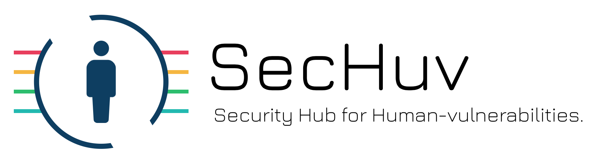

# SecHuv
Security Hub for Human-vulnerabilities.

## システム構成
- SecHuv
    - SecHuv:CHVE
    - SecHuv:Web
    - SecHuv:Mail
    - SecHuv:Heart

## ローカルサーバ環境
- `localhost:8000`: CHVE閲覧用サーバ
- `localhost:8080`: CHVE API
- `localhost:5000`: Swagger UI
- `localhost:5001`: Swagger Editor